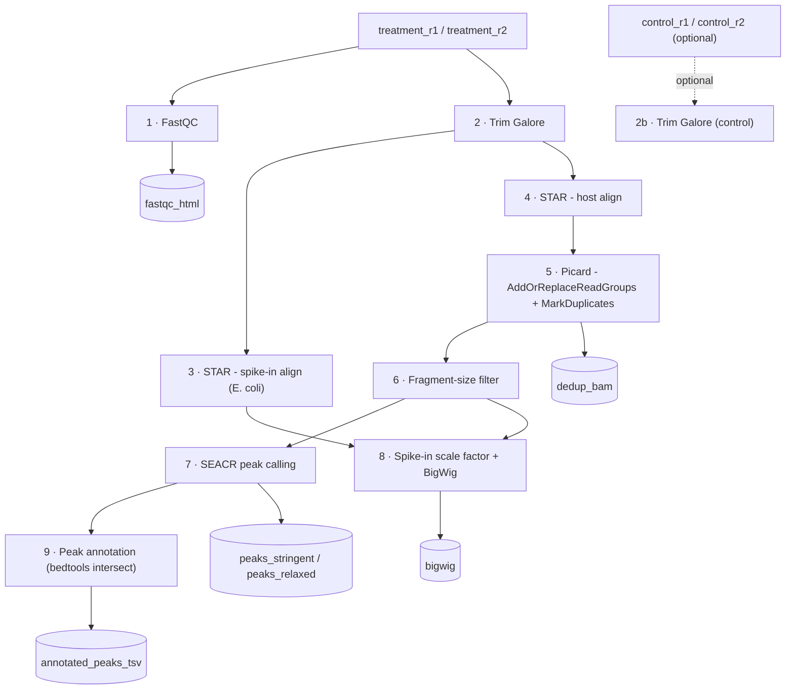

# CUT&RUN WDL Pipeline

[](https://github.com/openwdl/wdl)
[](#running)
[](#on-aws-healthomics)
[](#notes)

A WDL wrapper around the SEACR CUT&RUN bash pipeline, built to run on AWS via
Cromwell, AWS Batch, or AWS HealthOmics Workflows. It takes paired-end
treatment (and optional control) FASTQs through QC, spike-in-normalized
alignment, deduplication, fragment filtering, peak calling, and peak
annotation.

## Pipeline overview



## Pipeline steps

| # | Step | Tool | Purpose |
|---|------|------|---------|
| 1 | FastQC | FastQC | Raw read QC |
| 2 | Trim Galore | Trim Galore | Adapter/quality trimming |
| 3 | Spike-in alignment | STAR | Align to E. coli genome for normalization |
| 4 | Host alignment | STAR | Align to host reference genome |
| 5 | Deduplication | Picard | AddOrReplaceReadGroups + MarkDuplicates |
| 6 | Fragment filtering | awk/samtools | Histone vs. transcription-factor vs. default size windows |
| 7 | Peak calling | SEACR | Stringent (top 1%) and relaxed (top 5%) thresholds |
| 8 | Coverage tracks | bedtools/bedGraphToBigWig | Spike-in scale factor + BigWig generation |
| 9 | Peak annotation | bedtools intersect | Nearest gene feature per peak |

## Inputs

See [`inputs.json`](inputs.json) for an example.

| Input | Description |
|---|---|
| `treatment_r1` / `treatment_r2` | Paired-end FASTQs for the sample of interest |
| `control_r1` / `control_r2` *(optional)* | IgG or other control sample |
| `reference_genome_tar` | Tarball of a prebuilt STAR genome index (host) |
| `ecoli_genome_tar` | Tarball of a prebuilt STAR E. coli index (spike-in) |
| `genome_size_string` | `hs` / `mm` / `dm` / `ce` / `sc` — used for effective genome size calculations |
| `fragment_size_filter` | `histones` \| `transcription_factors` \| `default` |

## Outputs

| Output | Description |
|---|---|
| `fastqc_html` | FastQC report |
| `trimmed_r1` / `trimmed_r2` | Trimmed FASTQs |
| `dedup_bam` | Deduplicated BAM |
| `filtered_bam` | Fragment-filtered BAM |
| `peaks_stringent` / `peaks_relaxed` | SEACR peak calls |
| `bigwig` | Spike-in-normalized BigWig coverage track |
| `annotated_peaks_tsv` | Annotated peaks (peak + nearest gene) |

## Running

### Locally with Cromwell

```bash
java -jar cromwell.jar run cut_and_run_pipeline.wdl -i inputs.json
```

### On AWS HealthOmics

1. Build and push the Docker image to ECR (see [`Dockerfile`](Dockerfile)).
2. Register the workflow:
   ```bash
   aws omics create-workflow --name cut-and-run \
     --definition-zip fileb://workflow.zip \
     --parameter-template file://inputs.json
   ```
3. Start a run pointing at S3 input/reference locations.

## Repository layout

| File | Purpose |
|---|---|
| [`cut_and_run_pipeline.wdl`](cut_and_run_pipeline.wdl) | WDL workflow and task definitions |
| [`seacr_cut_and_run_pipeline_assignment_code.sh`](seacr_cut_and_run_pipeline_assignment_code.sh) | Original bash pipeline this WDL wraps |
| [`inputs.json`](inputs.json) | Example workflow inputs |
| [`Dockerfile`](Dockerfile) | Container image definition for pipeline tasks |

## Notes

> **Clinical use.** This pipeline is intended for clinical use. Any
> modification requires re-validation per internal SOPs.

- Reference indices (STAR for host genome and E. coli) must be pre-built
  and uploaded to S3 as tarballs before running.
